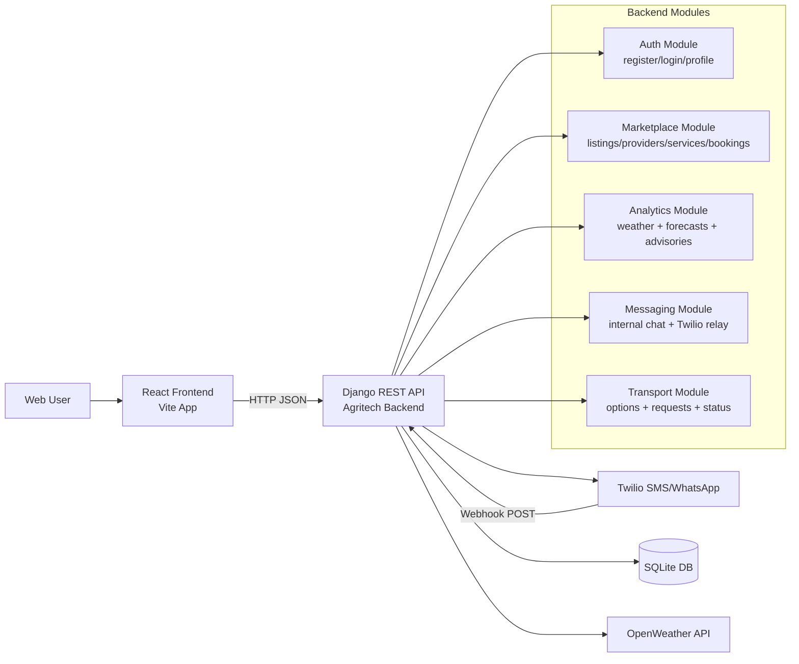

# Agritech Architecture and API Cheat Sheet

## Architecture Overview

## Core Data Model

- Users: Django `User` with role resolved via `FarmerProfile` / `BuyerProfile`.
- Marketplace: `Listing`, `Crop`, `Market`, `ServiceProvider`, `Service`, `StandardPrice`, `Booking`.
- Intelligence: `WeatherForecast`, `PriceForecast`, `FarmerInsight`, `StorageAdvice`.
- Trust/quality: `Rating`.
- Messaging: `Conversation`, `Message`.

## Frontend Routes (React)

- Public: `/`, `/login`, `/register`
- Auth required: `/platform`, `/marketplace`, `/providers`, `/services/:id`, `/transport`, `/messages`, `/inbox`, `/profile`
- Admin-only: `/providers/new`
- Admin-only: `/admin-dashboard`

## API Endpoint Cheat Sheet

Base URL: `http://localhost:8000/api/`

### Auth

- `POST /api/auth/register/` - Register farmer/buyer and return auth token.
- `POST /api/auth/login/` - Login and return auth token.
- `GET /api/auth/profile/` - Get current user profile (auth required).
- `PUT /api/auth/profile/` - Update current user profile (auth required).

### Platform Aggregate Endpoints

- `GET /api/platform/overview/` - High-level platform modules and flows.
- `GET /api/platform/auth/` - User/farmer/buyer totals + session status.
- `GET /api/platform/marketplace/` - Listing + booking summary data.
- `GET /api/platform/analytics/` - Weather, forecasts, advisories, chart series.
- `GET /api/platform/transport/options/?listing_id=<id>` - Transport options for listing (auth required).
- `GET /api/platform/transport/requests/` - List transport bookings (auth required).
- `POST /api/platform/transport/requests/` - Create transport booking (auth required).
- `PATCH /api/platform/transport/requests/<booking_id>/status/` - Update transport status (auth required; ownership/admin rules apply).

### Forecasts and Catalogs

- `GET /api/prices/` - Price forecasts.
- `GET /api/weather/` - Stored weather forecasts.
- `GET /api/weather/realtime/` - Live OpenWeather aggregate proxy.
- `GET /api/crops/` - Crop catalog.
- `GET /api/markets/` - Market catalog.

### Profiles and Discovery

- `GET /api/farmers/` - Public farmer profile list.
- `GET /api/buyers/` - Public buyer profile list.
- `GET /api/profiles/<username>/` - Public profile by username.

### Marketplace and Ratings

- `GET /api/listings/` - List marketplace listings.
- `POST /api/listings/` - Create listing (auth required).
- `PUT/PATCH/DELETE /api/listings/<id>/` - Owner/admin-managed listing updates.
- `GET /api/providers/` - List service providers.
- `POST /api/providers/` - Create provider (admin only).
- `GET /api/services/` - List services.
- `GET /api/services/<id>/` - Service detail.
- `GET /api/standard-prices/` - Service reference pricing.
- `POST /api/bookings/` - Create booking (auth required).
- `GET /api/insights/` - Current user farmer insights (auth required).
- `GET /api/ratings/` - List ratings.
- `POST /api/ratings/` - Create rating (auth required).

### Messaging and Twilio

- `POST /api/messaging/send/` - Send internal or external message.
- `GET /api/messaging/messages/?conversation_id=<id>` - Get conversation by id.
- `GET /api/messaging/messages/?conversation=<phone>` - Get conversation by phone.
- `GET /api/messaging/conversations/` - List user conversations (auth required).
- `POST /api/messaging/conversations/get_or_create/` - Get/create internal conversation (auth required).
- `POST /api/messaging/webhook/` - Twilio inbound webhook.
- `POST /whatsapp` and `POST /whatsapp/` - Twilio compatibility webhook aliases.

### Administration

- `GET /api/admin/metrics/` - Admin-only supervision metrics (recent activity + counts).

## Background/Operational Commands

Run from backend project root (`backend/agritech`):

- `python manage.py generate_insights` - Generate rule-based farmer insights.
- `python manage.py seed_fallback` - Seed fallback weather/storage data.
- `python manage.py retrain_models` - Export inbound message-response data for retraining.

## Notes

- Authentication uses DRF Token auth (`Authorization: Token <token>`).
- CORS is open in current settings (`CORS_ALLOW_ALL_ORIGINS = True`) for development.
- Current database is SQLite (`db.sqlite3`).
